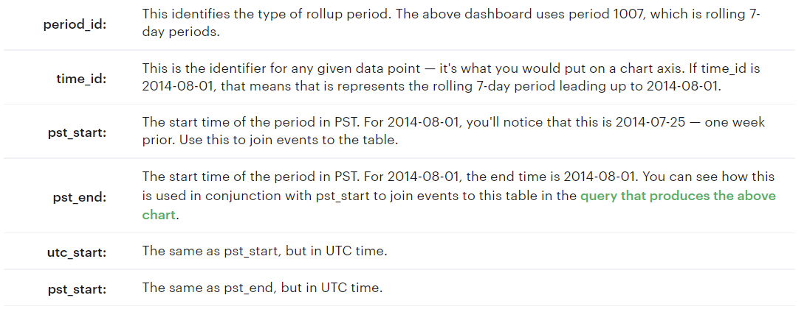

# Investigating-a-Drop-in-User-Engagement
In this case study, I managed to investigate a drop in user engagement in Yammer. (The Case Study is provided by Mode, and you can find it [here](https://mode.com/sql-tutorial/a-drop-in-user-engagement/)

## Problem

Yammer is a social network for communicating with coworkers. Individuals share documents, updates, and ideas by posting them in groups. Yammer is free to use indefinitely, but companies must pay license fees if they want access to administrative controls, including integration with user management systems like ActiveDirectory.

Yammer noticed a drop in Weekly Active Users, “the number of users who logged at least one engagement event during the week starting on that date”. Engagement is defined as having made some types of server call by interacting with the product (shown in the data as events of type “engagement”.)

My goal is to find out what causes the decrease in weekly active users shown in the [plot](https://app.mode.com/modeanalytics/reports/cbb8c291ee96/runs/7925c979521e/viz1/cfcdb6b78885) below:

## Plan

I first brainstorm some potential causes for the drop in engagement:

- Holiday
- Broken Features
- Marketing Events
- Traffic shutdown (outage)

Then, approach to the dataset to diagnose the problems and see if any of these fits into play.

## Data

There are four tables in total.

### Table 1: Users

This table includes one row per user, with descriptive information about that user's account.

### Table 2: Events

This table includes one row per event, where an event is an action that a user has taken on Yammer. These events include login events, messaging events, search events, events logged as users progress through a signup funnel, events around received emails.

### Table 3: Email Events

This table contains events specific to the sending of emails. It is similar in structure to the events table above.

### Table 4: Rollup Periods

The last table is a lookup table that is used to create rolling time periods. 

## Analysis

See doc.file for details.

## Conclusion

As we define the engagement as server calls made by our user to interact with the Yammer app, I found that there are 2 metrics that account for the drop in user engagement from July to August, 2014: one is the number of users that make server call action (event_type as “engagement”), and second is the email clickthrough rate. Considering those whose action are viewed as engagement, we can see that there is a sharp decrease in number of mobile device users. It accounts for over 50% of the total decrease in the drop of engagement. In addition, email clickthrough rate decrease by 27% from July to August, and we can find that the decrease is also mainly in mobile device. It seems that both metrics are somehow related to mobile device. Furthermore, I found that although users have increasing number in opening emails from both weekly digest type and reengagement type. The click through rate increased in reengagement email, but decrease in weekly digest emails.

## Recommendation

My recommendation is to immediately take a look into the weekly digest emails specially for mobile device like phones and tablets. I think it is very likely that there is a technical problem there, which makes our users difficult to interact with the email links. 

## Further Analysis

- (location) Consider group users by location, and see if there are anything that we did not notice before.
- (cohort analysis) See if the change is attributed to a short user life-cycle
